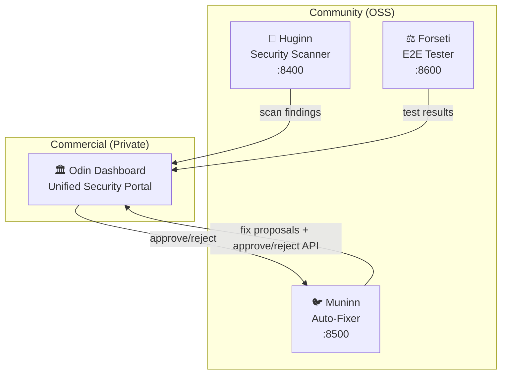

# SI-01: Software Implementation Report — Odin

**Product:** 🏛️ Odin (Security Command Center — Commercial)
**Document ID:** SI-RPT-ODIN-001
**Version:** 0.1.0
**Date:** 2026-03-20
**Standard:** ISO/IEC 29110 — SI Process
**Stack:** HTML/CSS/JS (Static SPA) → Rust Backend (planned)

---

## 1. Product Overview

| Field | Value |
|:--|:--|
| **Repository** | MegaWiz-Dev-Team/Odin (private) |
| **Port** | `:3000` (planned via Asgard) |
| **License** | Proprietary (Commercial) |
| **Dependencies** | Huginn API (:8400), Muninn API (:8500), Forseti API (:8600) |
| **Business Model** | Open-Core — Odin is the commercial layer on top of OSS agents |

---

## 2. Architecture (Open-Core Model)

---

## 3. Functional Requirements Traceability

| FR | Description | Sprint | Status |
|:--|:--|:--|:--|
| FR-O01 | Unified dashboard (aggregate Huginn/Muninn/Forseti) | S1 | ✅ Done |
| FR-O02 | Review panel with diff viewer | S1 | ✅ Done |
| FR-O03 | Approve/reject workflow (via Muninn API) | S1 | ✅ Done |
| FR-O04 | Live config display | S1 | ✅ Done |
| FR-O05 | Stats grid with auto-refresh | S1 | ✅ Done |
| FR-O06 | Security posture score | S2 | 📋 Planned |
| FR-O07 | SLA tracking & remediation deadlines | S2 | 📋 Planned |
| FR-O08 | ISO audit trail & compliance reports | S2 | 📋 Planned |
| FR-O09 | Multi-tenant support | S3 | 📋 Planned |
| FR-O10 | Dashboard authentication | S2 | 📋 Planned |

---

## 4. UX Modes

| Mode | Description | Target User |
|:--|:--|:--|
| 🖥️ **Dashboard (Review)** | User reviews diffs, approves/rejects fixes | Security team, compliance |
| 🤖 **Auto-Pilot** | Agents run autonomously, user sees summary | CI/CD, nightly scans |
| 💬 **Chat-Driven** | Natural language commands via MCP | Developers |

---

## 5. Sprint History

| Sprint | Duration | Scope | Status | Key Deliverables |
|:--|:--|:--|:--|:--|
| **S1** | 1 week | MVP Dashboard | ✅ Done | Static SPA, stats grid, review panel, cross-origin API |
| **S2** | 2 weeks | Security & Analytics | 📋 Planned | Auth, posture score, SLA, ISO reports |
| **S3** | 2 weeks | Multi-tenant | 📋 Planned | Tenant isolation, role-based access |

---

## 6. Community vs Commercial Feature Matrix

| Feature | Community (Free) | Commercial (Odin) |
|:--|:--|:--|
| Security scanning API | ✅ Huginn | ✅ + visual dashboard |
| Auto-fix API | ✅ Muninn | ✅ + review UI + approval workflow |
| E2E testing API | ✅ Forseti | ✅ + test analytics |
| Unified dashboard | ❌ | ✅ |
| SLA tracking | ❌ | ✅ |
| Security posture score | ❌ | ✅ |
| Audit trail (ISO reports) | ❌ | ✅ |
| Multi-tenant | ❌ | ✅ |

---

## 7. Risk Assessment

| Risk | Impact | Mitigation |
|:--|:--|:--|
| No authentication on dashboard | High | FR-O10 (planned S2) |
| Cross-origin API calls blocked | Medium | CORS permissive on agents |
| Single static page (no backend) | Low | Planned Rust backend in S2 |
| Commercial code in public repo | High | Separate private repo ✅ |

---

*บันทึกโดย: AI Assistant (ISO/IEC 29110 SI Process)*
*Created: 2026-03-20 by Antigravity*
*Sprint 1 completed: MVP Dashboard + Review Mode Integration*
